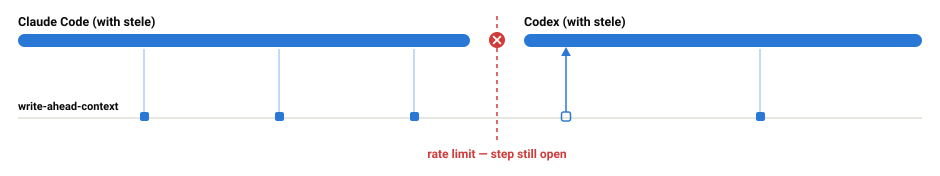
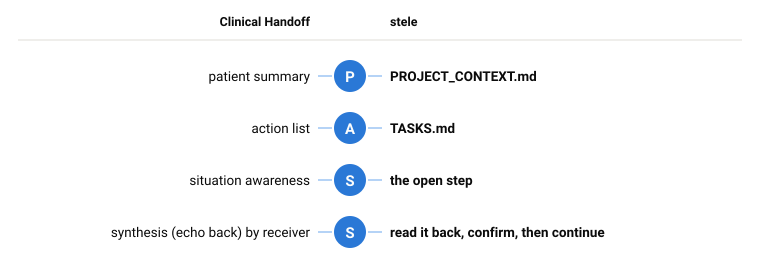

# stele

**Durable task state for AI coding agents, in plain markdown.** Stop mid-task in one agent, start another — different model, harness, or provider — and it picks up where the last one stopped without being told anything.

<picture>
  <source media="(prefers-color-scheme: dark)" srcset="docs/img/lifecycle-dark.svg">
  
</picture>

Every other answer to this is a *handoff* — you run `/handoff` and it writes a summary before you leave. That fails in exactly the case you need it, because a session that has been rate-limited or has crashed never gets to write anything. So stele writes before each step instead, and the break costs one step rather than everything.

## Install

Since you are already here, and you have an agent. Install in one line. 😉

> Install https://github.com/johnwangwyx/stele as a skill under your framework.

## To use

### 1. Start managing a project

> `/stele` manage this project with stele

`/` is Claude Code — Codex uses `$stele`, and other harnesses have their own way to start conversation while mentioning a skill.

New project, same sentence. On an existing repo the skill reads what is already there.

### 2. Now it is interruptible

Hit a usage limit, crash, close the laptop, switch provider, come back in three weeks. The record is already on disk, because every write happened *before* the work it describes rather than after it. Nothing needs saving on the way out.

### 3. Resume, in any harness

> `/stele` resume where it is left off

Note: You will mostly not even need the skill trigger (`/stele` or `$stele`). That first run left a pointer in `AGENTS.md` (creating it if there was none), so the next agent or harness knows to load stele.

## The protocol, The Inspiration

<picture>
  <source media="(prefers-color-scheme: dark)" srcset="docs/img/pass-dark.svg">
  
</picture>

**I-PASS** is the shift-change handover protocol hospitals adopted once transitions proved to be where patients come to harm. The departing clinician holds context that never reached the charts or reports, and the arriving one cannot know what is missing. **It is an example of an evidence-based option for conducting a structured handoff.**

## How it works

Three levels, and nothing else:

**Project** — the standing facts an agent cannot cheaply derive and would otherwise get wrong: how to build and test, what not to touch, what not to run, the decisions that already bind future work.

**Task** — one unit of work that will outlive a single session. Its goal, how you would know it is finished, its current state in a few lines, and an append-only record of what was already tried and failed. That last part is the most expensive thing to lose.

**Step** — a slice of a task small enough to sit inside one sitting. This is where write-ahead happens: before touching anything, the agent records what it is about to do, which files, and the commit it is starting from. Afterwards it records the outcome.

That last detail is what makes a cold resume mechanical rather than a guess. The commit plus the file list means the next agent can diff *exactly* what the previous one had half-finished, instead of inferring it from prose. And because the record is written first, a session that dies has already written everything except the step it died inside.

See [`examples/stele/`](examples/stele/) for a complete, realistic instance.

## License

MIT
