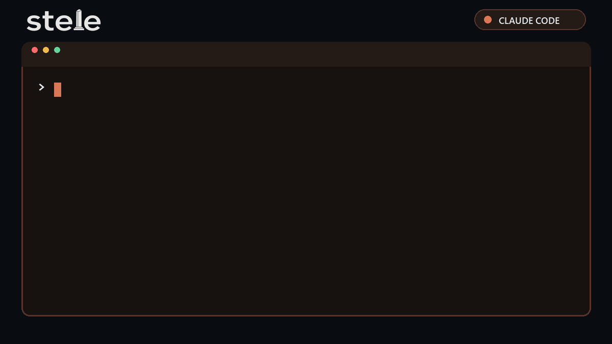
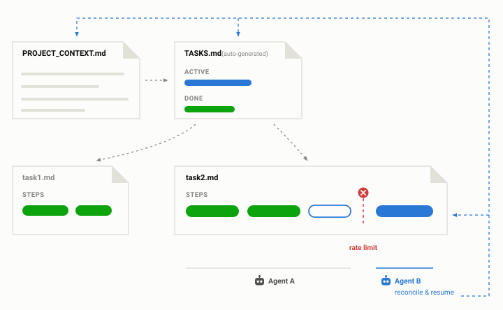

<p align="center">
  <picture>
    <source media="(prefers-color-scheme: dark)" srcset="docs/img/logo-dark.png">
    
  </picture>
</p>

<p align="center">
  <a href="LICENSE"></a>
</p>

**Write-ahead task memory and project tracking for coding agents.** Hit a usage limit, crash, or switch harnesses—then resume the same work without saving a handoff or reconstructing context. The record that makes that possible is also the project history you never got round to writing.

<p align="center">
  
</p>

## Install

```bash
npx skills@latest add johnwangwyx/stele --global
```

This installs stele into the harnesses it detects on your machine, for all your projects.

## Use

### 1. Start managing a project

> `/stele` manage this project

New project or an existing repo, same sentence. From here the work is tracked whether or not anything ever interrupts it: what each task is for, what was tried, what was rejected, what are the decisions, and what every step was checked against.

### 2. Now it is interruptible

> *(nothing to type—that is the point)*

Hit a usage limit, crash, close the laptop, switch harnesses, or come back in three weeks. The record is already on disk because every write happened before the work it describes. Nothing needs saving on the way out.

### 3. Resume in any harness

> `/stele` resume where it left off

You will often not need to trigger the skill explicitly. The first run leaves a pointer in `AGENTS.md` so the next agent or harness knows to load stele.

## How it works

<picture>
  <source media="(prefers-color-scheme: dark)" srcset="docs/img/lifecycle-dark.svg">
  
</picture>

Most agent memory is write-after: it records a handoff or summary at the end of a session. That works until the session ends unexpectedly and never gets the chance.

stele writes each step *before* the work it describes. The record does not depend on the session surviving long enough to write it.

<picture>
  <source media="(prefers-color-scheme: dark)" srcset="docs/img/hierarchy-dark.svg">
  
</picture>

Three levels, and nothing else:

**Project** — build and test commands, invariants, and decisions that future agents should not have to rediscover.

**Task** — one unit of work, its goal, current state, and the failed attempts another agent should not repeat.

**Step** — the next action and affected files, recorded before work begins and closed only after verification.

On resume, the next agent reads the project context, the generated task index, and the open step. It can inspect what is on disk, determine where the interruption happened, and continue without an explanation from the previous session.

See [`examples/stele/`](examples/stele/) for a complete, realistic instance.

### Worth having even if nothing ever crashes

Interruption is the reason to install it. What you actually get is a project tracker that nobody had to maintain.

Because the record is written as a condition of doing the work, `tasks/done/` accumulates into a history without anyone deciding to keep one: what was attempted, what was rejected and why, what each step was verified against. Decisions collect in one place, each traceable to the task that produced it. Six months later, *"why didn't we do X?"* has an answer on disk rather than in whoever still remembers — and it is answered by the record of the attempt, not a reconstruction of it.

That history is a side effect of the mechanism, which is the only reason it stays accurate. Documentation written to be documentation goes stale; this is written because the next step depends on it.

<details open>
<summary><strong>Reliability details</strong></summary>

- Each task records the tools and skills its plan assumed, so a different harness can identify missing capabilities before acting.
- `TASKS.md` is generated from individual task files on every resume rather than maintained by hand.
- A step is marked done only after its check has run successfully.
- Failed attempts remain append-only so the next agent does not pay for the same dead end twice.
- Decisions that affect future work are promoted when they are made, not when the task closes.

</details>

<details open>
<summary><strong>Where the protocol comes from</strong></summary>

<picture>
  <source media="(prefers-color-scheme: dark)" srcset="docs/img/pass-dark.svg">
  
</picture>

**[I-PASS](https://www.ahrq.gov/teamstepps-program/curriculum/communication/tools/ipass.html)** is a structured clinical handoff protocol. It addresses the same fundamental risk: the outgoing participant holds context that the incoming participant cannot know is missing. stele adapts that idea to interrupted coding-agent work.

</details>

<details open>
<summary><strong>What context it puts in your repository</strong></summary>

all plain markdown, all committed with the code they describe.

```
stele/
  PROJECT_CONTEXT.md      standing facts - checks, guardrails, decisions
  TASKS.md                generated index - never edited manually
  tasks/
    0007-cursor-pagination.md    one live task (as example)
    done/
      0005-choose-pagination-strategy.md    closed, kept whole
```

</details>

## License

MIT
